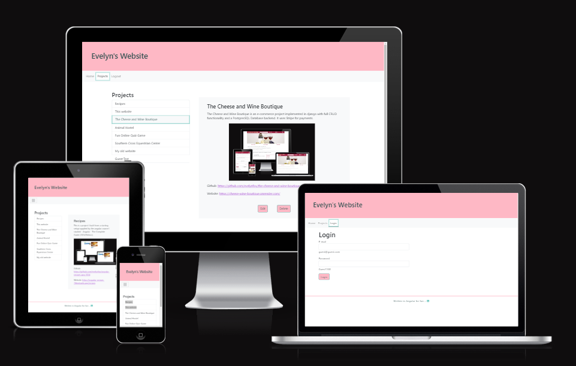

# angular-web-site

The goal of this project was to build a website in Angular in order to practise what I had learnt  
in the Angular course  I have just completed and to introduce myself and showcase my projects. 

The home page details some of my qualifications and the projects page lists some of my more recent projects.  
There is also a project page which details a particular projects and displays an image. 
There is an authentication page which you can sign into using the email address guest@guest.com and password Guest@200. 
This allows you to add,edit and delete projects. 

# Wireframes
I have used [Balsamic](https://balsamiq.com/wireframes/ "Balsamic") to develop some wireframes for my website. 

The wireframes are below:

### [Components Wireframe](docs/wireframes/Components.png "Components wireframe")
### [Home Wireframe](docs/wireframes/Home.png "Home wireframe")
### [Projects Wireframe](docs/wireframes/Projects.png "Projects wireframe")

## Features 

- The site is entirely written in angular. It uses routing and forms.
- It has a firebase backend where the projects are written and retrieved from.
- It has authentcation and users can loggin using a guest signon displayed on the login screen.
- When signed in guest users can add,edit and delete any guest projects but not any I added myself as administrator.
- Projects added by guests are marked as such with Guest: added to the name and 'Added by guest:' added to the description line.
- Projects added by guests are not displayed unless you are logged in.  

## Agile Implementation
- I implemented this project as an agile project which I set up in github - Develop Web Site
- I did it over two sprints which I set up as milestones.
- I created issues for all the features of the projects. In total 42 issues.
- I used a Kanban board to progress my issues and I used branches for the development work.

## Design
-   #### Colour Scheme
    The main colour I have chosen for the site is pink. It is one of my favourite colours and is warm and inviting.   
    I have chosen a dark slate grey to contrast with this an provide an easily legible font colour.  
    I have added an additional turquoise colour, another favourite colour of mine, to use for touches and to add another colour aspect.   
    I have kept the body white and also added a black colour for clear contrast on the main body of the site.

    Here is the colour palete generated on [Colormind](http://colormind.io/).
       

